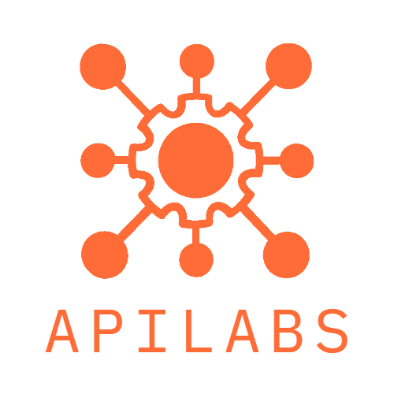
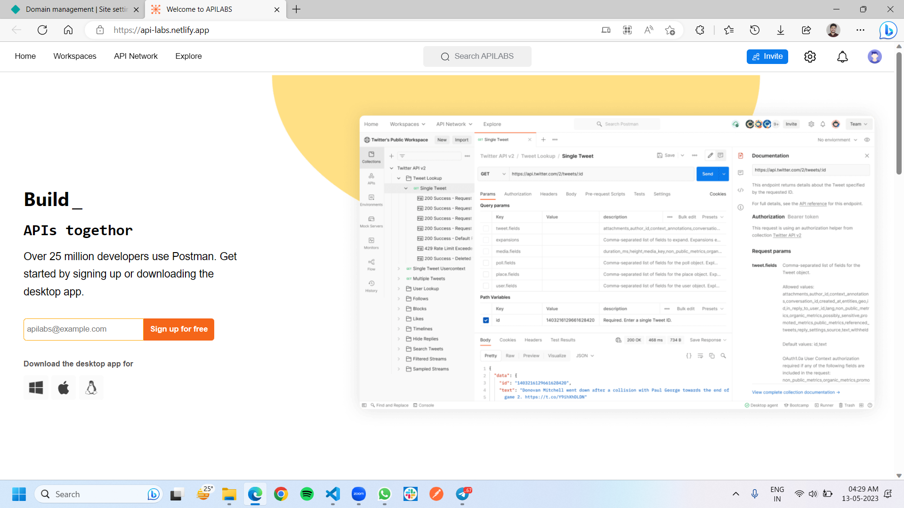
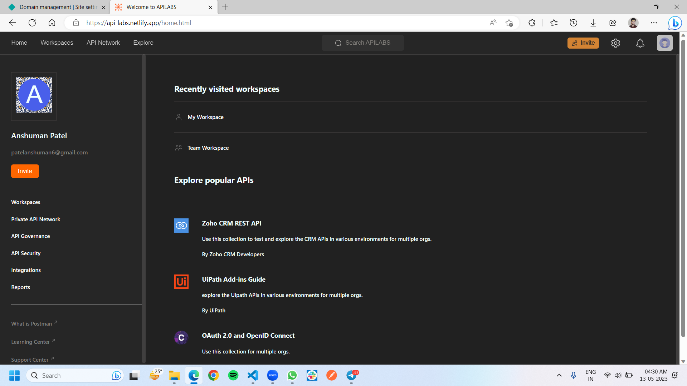
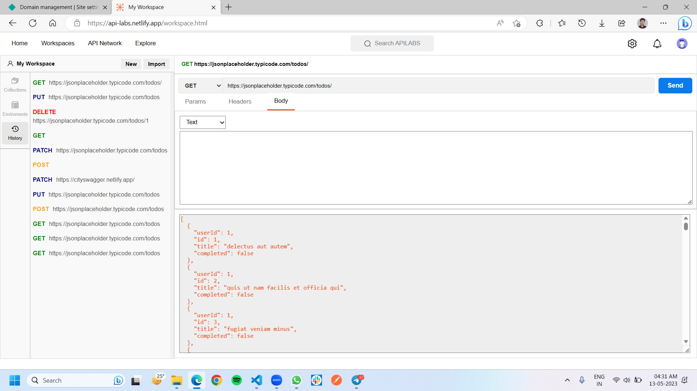

# ApiLabs a PostMan Clone
ApiLabs is a clone of Postman, a popular API development tool used by developers to design, test, and document APIs. It provides a user-friendly interface that allows users to easily send HTTP requests to API endpoints and view the responses. Additionally, like Postman, ApiLabs includes features for automated testing, collaboration, and documentation, making it a valuable tool for API development teams .

## Authors
- [@Anshuman Patel](https://www.github.com/patel-anshuman)

- [@Adesh Tayde](https://www.github.com/Adesh856)

- [@Anurag singh](https://www.github.com/anurag1109)

- [@Prabhat Kumar Gupta](https://www.github.com/prabhatgupta11)

- [@Vishal Dnyandeo Patil](https://www.github.com/VishalDnyandeoPatil)

## Features

- Fetching api

- Signout

- Responsive 

- Authentication

- Dark mode 

## Roadmap

- landing Page

- SignIn/SignUp Page

- Home Page

- Workspace Page

- Back-End 

## Deployed link 
[https://apilabs.netlify.app/](API Labs)

## Screenshots

 
 

 
 

 
 

